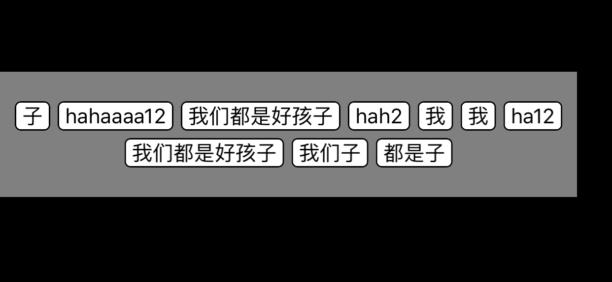
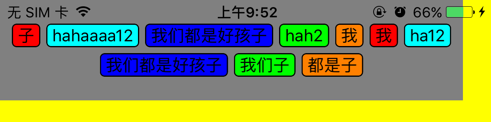
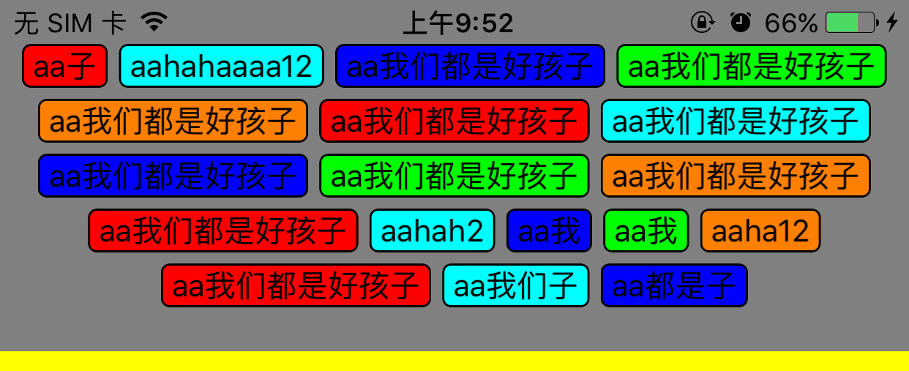

# TagViewController
标签展示，适合多种情况下的标签显示处理，有点击功能，

可以人性化的配置能你需要的样式   

```
@property (nonatomic, assign) TagsAlignment tagsAlignment;    // 对其方式
@property (nonatomic, strong) NSMutableArray *tagsArray;      // 所有的标签
@property (nonatomic) CGSize maxSize;                         // 标签页面最大的高宽大小
@property (nonatomic, strong) UIColor *viewBackgroundColor;   // 总体的背景色
@property (nonatomic, strong) UIColor *tagsWordsColor;        // 字体的颜色（目前近支持单种颜色）
@property (nonatomic, strong) UIColor *tagsBorderColor;       // 每个标签的边框颜色
@property (nonatomic, strong) UIColor *tagsBackgroundColor;   // 每个标签的背景颜色
@property (nonatomic) float tagsBorderWidth;                  // 标签的边框宽度
@property (nonatomic) float tagsBorderCornerRadius;           // 标签的边框圆角幅度
@property (nonatomic) float tagsMargin;                       // 标签之间的距离
@property (nonatomic) float tagsMarginLeftAndRightForSubView; // 相对父View，最左最右的标签相对父View的Margin值
@property (nonatomic) float tagsMarginTopAndBottomForSubView; // 相对父View，最上最下的标签相对父View的Margin值
@property (nonatomic) float fontSize;                         // 字体大小咯
@property (nonatomic) float tagsHeight;                       // 标签的高度
```

示例图片：




